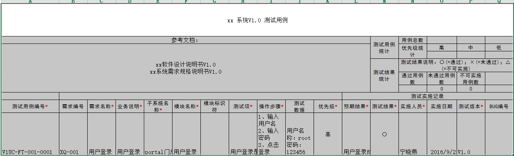
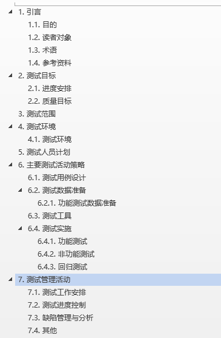
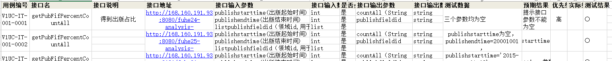
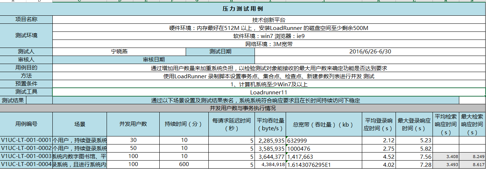
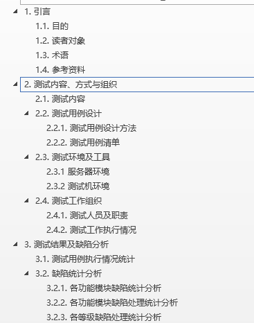
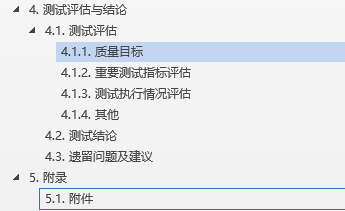
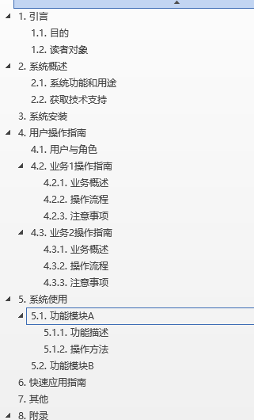

# 1.	目的
对软件产品（项目）的特性进行测试，以确保产品（项目）的符合性。
# 2.	范围
适用于产品（项目）开发阶段及实施阶段的测试。
# 3.	职责
- 项目经理负责测试活动的申请、明确测试内容并将测试产品（项目）提交。
- 测试组成员负责测试用例的设计、编写和测试实施。
- 测试经理负责组织测试过程，执行完成后的统计分析与总结。

# 4.	工作程序
## 4.1.	测试启动
- 在产品（项目）设计阶段，由项目经理提交测试申请，测试经理组织了解产品（项目）需求。
- 在产品（项目）开始开发阶段，测试经理组织编写测试大纲和测试进度计划。
- 在产品（项目）开发阶段，测试经理参照测试大纲，结合项目的具体情况建立测试小组，并根据设计原型、需求设计说明书、详细设计说明书 进行需求分析编写测试用例。

## 4.2.	测试
### 4.2.1.	测试准备
- 除单元测试以外，在进行各种测试前应做好下述准备：
- - 配备测试用的硬件环境；
- - 建立相应的运行环境和网络环境；
- - 准备测试数据；
- - 组织和培训测试人员；
- - 制定测试计划。
- - 编写测试用例。

### 4.2.2.	测试依据
 需求分析文档、设计说明书、原型设计图、测试大纲、测试计划、测试用例、上阶段测试记录、用户提供的相关项目资料等。
### 4.2.3.	测试测试计划的制定
- 各阶段的测试计划内容应包括测试时间、人员安排、设备环境的建立、测试记录、统计方法、问题反馈处理办法、测试用例和测试数据等。
- 测试人员或组长制定单元测试计划、系统测试计划、验收测试计划，提交测试经理批准后执行。

### 4.2.4.	测试用例的设计
#### 4.2.4.1.	单元测试用例的设计
测试组成员根据单元测试计划并参阅详细设计说明书，针对详细设计说明书的每一个模块，设计出合理适用的单元测试用例，并指出用黑盒或（和）白盒方法进行测试。测试经理确认测试用例是否充分覆盖，并组织有关人员对测试用例进行评审，具体操作可参见《软件评审作业指导书》。
#### 4.2.4.2.	系统测试用例的设计
测试组成员根据系统测试计划，参阅概要设计说明书、需求分析文档和用户提出的系统性能方面的要求，针对需求分析报告及功能规格说明书中描述的功能需求和概要设计说明书中描述的模块集成情况分别设计出适用的黑盒测试用例或（和）集成模块的白盒测试用例分析文档，测试用例应覆盖所有的功能点，（若因条件所限，不能进行测试的，应在测试报告中说明。）主要应从如下几个方面考虑：
兼容性测试、数据和数据库完整性测试、性能评测、负载测试、强度测试、容量测试、安全性和访问控制测试、故障转移和恢复测试、配置测试、安装测试。系统测试用例应经过测试组的自检、互检，经测试经理审批后，方可用于测试。在进行系统测试用例的设计过程中应定期将文档提交到SVN中。
### 4.2.5. 测试用例规范
#### 4.2.5.1. 测试用例整体要求

一般的测试用例包括如下几个部分：需求标识、用例标识、用例名称、用例级别、预置条件、操作步骤、预期结果、备注、用例编写者、测试执行者、测试日期。

**需求标识**：唯一标识，与用例编号对应，为一对多关系。

**模块标识**：唯一标识，与用例编号对应，为一对多关系。

**用例标识**：能够准确的标识每一条用例，每一个用例编号在所有测试用例中必须唯一。

**用例名称**：能够清晰表达测试用例的测试目的和关键测试要素。

**用例级别**：区分测试用例的重要程度，确定用例执行的级别。

**预置条件**：需要描述测试所需要处于的外部环境和测试前测试对象及辅助对象所需要处于的状态和配置。需要保证在完成预置条件中所描述的状态和配置以及外部环境后，测试执行的正确性、一致性。

**用例场景**：主要描述该用例在什么场景下用到，让用例执行者在了解业务场景的基础下去执行测试用例。

**操作步骤**：为了达到测试用例的测试目的，所需要执行的操作；每个操作步骤对应一个预期结果。

**测试版本**：当前测试用例设计对应的测试版本号。

**预期结果**：针对测试用例的测试目的，测试步骤中操作后对应的预期输出状态。

**实际结果**：针对测试用例，测试步骤中操作后对应的实际输出状态。

**bug编号**：填入该用例对应bug编号，若无为空即可。

**用例编写者**：设计用例的人员。

**测试执行者**：按照该用例执行测试的人员。

**测试日期**：执行测试的时间。

#### 4.2.5.2. 用例实现规则

**规则1**：用例要素要求
需求标识、模块标识、用例标识、用例名称、用例级别、预置条件、操作步骤、预期结果、实际结果、用例场景、测试版本 为必选要素，不能为空，其他字段为可选要素。

**规则2**：用例名称描述要求

用例名称不允许出现重复、包含关系，或者仅有数字编号差异。

**规则3**：用例级别分为高、中、低3个级别

**高**（优先执行）：产品基本的功能验证，不设计配置及场景测试。即关键路径的测试用例，包括最常执行的功能、基本流程的输入以及界面数据有效性校验作为高级别的测试用例；若该级别的测试用例完全执行通过，则表示该软件功能渐趋稳定。

**中**（次级执行）：产品功能测试，常见的配置、交互及场景的测试。即可接收级测试的用例，包括不常执行的功能、异常流程的输入、边界值以及异常数据的输入作为中等级别的测试用例。

**低**（最后执行）：冷僻的产品功能，非常见的异常场景测试。即建议执行的测试用例，也就是说该级别的测试用例不是不重要，而是该级别的用例在整个项目的生命周期内不是常常被运行，包括：界面显示、错误信息提示不统一、可用性、压力和性能测试等。

**规则4**：多条预置条件、测试步骤、预期结果描述要求
- 1）每一条预置条件、测试步骤、预期结果必须以序号编号。测试用例编号方式为“N、”，N为一位数字，从1开始编号。
- 2）多条预置条件、测试步骤、预期结果之间必须用回车换行。

**规则5**：预期结果与测试步骤对应要求
- 1）每一条预期结果与其对应的测试步骤的编号要求保持一致。

- 2）每一测试步骤只能对应一条预期结果。

**规则6**：用例描述中不包含模糊描述

测试用例的用例名称、预置条件、测试步骤、预期结果中均不允许出现模糊的描述，导致引起歧义或无法准确判断测试用例测试结果通过与否。

#### 4.5.2.3. 测试用例设计步骤

**测试需求分析**：从产品需求文档中，找出待测模块的需求，通过自己的分析、 理解，整理成为测试需求，要清楚被测对象具体包含哪些功能点。

**测试用例设计**：测试用例设计的类型主要包括功能测试、边界测试、异常测试等，在设计用例时要尽量考虑边界、异常等情况。

**测试用例评审**：由测试用例设计者发起，参加的人员需包括测试负责人、项目经理、开发人员及其他相关的测试人员。
测试用例完善：测试用例编写完成之后需不断完善，软件产品新增功能或更新需求后， 测试用例必须定期修改更新；在测试过程中发现设计测试用例时考虑不周，需要对测试用例进行修改完善；产品上线后客户反馈的软件缺陷，如果缺陷是因测试用例存在漏洞造成，也需要对测试用例进行完善。

#### 4.5.2.4. 测试用例模板

### 4.2.5.	自动化测试
#### 4.2.5.1.	测试工具
- 测试人员 机器操作系统win7、 win8、win10 系统
- 测试人员需要在本机上安装JDK1.8， eclipse 编辑器、python3.5、 selenium2
- 浏览器建议安装：firefox47， google40， ie11
- 在服务器安装 mysql5.5， jira，以及Jenkins

#### 4.2.5.2.	测试数据
- 在测试过程中使用的数据统一用excel进行管理
- 测试数据管理：excel

#### 4.2.5.3.	持续化集成
在对应的服务器安装Jenkins 进行程序的持续化集成
### 4.2.6.	性能测试
- 在测试人员本机安装LoadRunner（根据项目需要，若用Loadrunner 进行性能及压力测试时需要安装启动）
- 在测试人员本机安装jmeter （正常所有项目均使用Jmeter 进行性能测试）

### 4.2.7.	安全性测试
在测试人员本机安装AppScan 进行安全性测试（根据项目需要安装）
### 4.2.8.	兼容性测试
- 安装虚拟机在对应的虚拟机上安装不同版本的浏览器，在真实的浏览器下操作
- 借助selenium + browser driver 进行主流浏览器的兼容性测试

### 4.2.9.	接口测试
在测试人员本机安装SoupUI 进行接口测试
### 4.2.10.	测试实施
根据测试目的的不同，分几个阶段进行测试。
#### 4.2.10.1.	单元测试
测试人员从用例库中提取测试用例，按照测试大纲和测试计划执行单元测试，确保通过单元测试通过准则，保证模块运行正确、界面与设计说明书相一致。
#### 4.2.10.2.	系统测试
测试组成员从用例库中提取系统测试用例，按照测试计划执行系统测试 ，测试的内容按照测试用例进行。系统测试应力图测试完整，需求制作安装盘的，应以安装的版本进行测试。安装盘由项目组制作。保证软件产品数据流计算的正确性、软件产品整体运行的稳定性、与其他软件产品数据接口间的正确性，以及与需求说明书的一致性
#### 4.2.10.3.	验收测试
- 测试人员应严格按照测试大纲和测试计划所确定的测试用例进行测试，测试人员应如实、完整地记录测试结果，对问题级别的判断应客观、准确。（在测试中如发现测试用例以外的软件问题，也应作好记录。）保证软件产品运行的稳定性和与需求说明书的一致性，同时进行软件产品加密、安装正确性的测试，以保证发版软件产品的正确性。
- 在验收测试完成,评审会通过、项目经理批准的情况由项目组主要领导成员将测试产品提交给用户（或相当于用户的角色）进行β测试,并由项目组负责指派人员对用户β测试的跟踪工作,及时收集顾客反馈的问题，并根据顾客的反馈情况进行相应的处理。

### 4.2.11.	测试记录的控制
#### 4.2.11.1.	bug提交
在测试过程中，测试人员应按《单元测试错误等级的划分标准》和《系统测试错误等级的划分标准》的规定进行判定并做好测试记录将bug提交到Jira bug管理中，随时准确详细地记录软件的错误和不妥之处。每个错误（建议）所属的模块、出错描述、错误等级、问题状态、测试日期、测试人、测试版本、图片（需要时）都应该在相应的栏目中填写清楚；所作的问题描述要求开发人员根据记录的步骤进行操作，可重现错误重现，不可重现错误能理解操作步骤，寻找错误根源。
#### 4.2.11.2.	测试报告
各阶段测试完成后，测试组应提交软件测试报告，报测试经理审批后归档。
#### 4.2.11.3.	对测试问题判别
- P1  致命错误：将使整个系统无法满足关键性、技术性指标要求，将导致工程失败；
- P2  严重问题：导致系统无法正确运行；
- P3  一般问题：会降低系统可靠性、安全性问题，降低系统的可操作性问题；
- P4  轻微问题：对整个系统的影响较小，可能降低系统的效率或产生其他后果。

### 4.2.12.	用户手册
系统测试完毕后，测试人员根据系统出具项目的使用的使用手册，从项目不同的角色（如果有多角色），描述各个模块的使用说明，供用户查阅，帮助用户更好地使用系统。
### 4.2.13.	测试反馈和处理
#### 4.2.13.1.	对测试问题的处理
对测试中发现的问题，项目经理应及时组织修改，并定期将修改的版本提交给测试组进行下一轮的测试。
#### 4.2.13.2.	测试记录传递
- 单元测试、系统测试和验收测试完成后，由测试人员将测试计划、测试用例，以及测试报告交测试经理审核编号后传递给项目经理，由项目经理将测试的文档进行存档。
- 用户测试后的结果，由用户反馈到项目经理，项目经理根据具体情况进行传递。

### 4.2.14.	不合格项控制
对测试记录的不合格项，由测试人员及时反馈到软件开发人员，并按各自的标准要求进行修改和确认后再重新测试。
### 4.2.15.	让步放行规定
在例外情况下，当测试中出现某项“不通过”时，在不影响下一阶段开发、不影响软件产品结构、不影响用户使用的情况下，经项目经理批准可以进行下一阶段的工作；如提交用户，需经部门经理批准，并取得用户的同意。但测试人员必须作好记录，并采取措施跟踪和处理，在修改版完成后应及时给用户更换版本。
## 4.3.	项目总结
 在项目整个测试过程完成后由测试经理根据项目各阶段测试报告、各阶段统计分析数据等对整个测试过程进行总结评价，对测试能力、测试进度、测试人员、测试内容等进行分析，找出测试过程中的成功点、不足点，形成测试总结报告。
# 5.	附件
测试过程中使用的一些模板
- 测试计划模板

- 功能测试用例模板

测试用例编号规则：采用“V1UC-FT-00A-序号”形式对测试用例进行统一编号。其中，"V1UC"表示软件V1.- - 0版本的测试用例（UseCase首字母）;"FT"是指功能测试用例，00A 代表是第几个模块"序号"是0001开始的数字顺序，以4位数字表示。
- - 安全性测试 ST Safety Testing
- - 功能性测试 FT   Functional Testing
- - 兼容性测试 CT  Compatibility Testing
- - 易用性测试 UT   Usability Testing
- - 边界测试   BT Boundary  Testing
- - 压力测试   LT Load Testing
- - 用户界面交互性测试 ITU User interface Testing
- - 接口测试  IT interface Testing
- 接口测试用例模板

- 性能测试用例模板

- 测试报告模板

- 用户手册模板

