# Microsoft Hyper-V Server 2012 安装与配置
## 第1章 Hyper-v Server 2012 安装与配置
### 第1节 Hyper-v Server 2012 安装
1. 启动服务器电源，将Hyper-v Server 2012安装文件U盘插入USB接口。启动系统安装向导
2. 选择安装语言，时间和货币格式，键盘输入法，点击“下一步”。
3. 点击“现在安装”                             
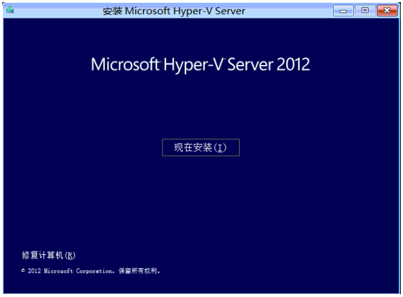 

4. 选择“我接受许可条款”，点击“下一步”                  
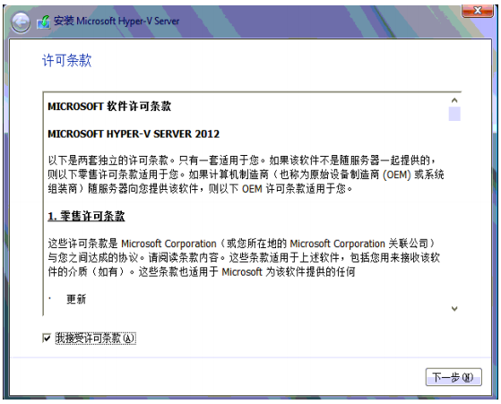
    
5. 初始全新安装，选择“自定义”

 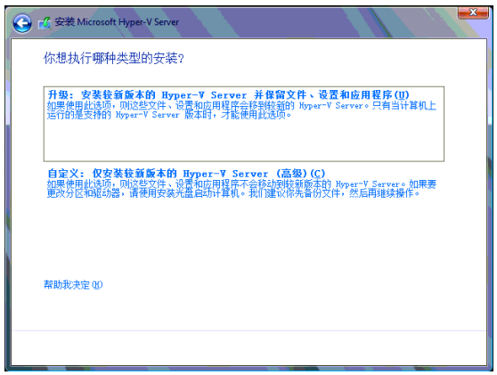

6. 规划磁盘分区和大小，点击“下一步”

 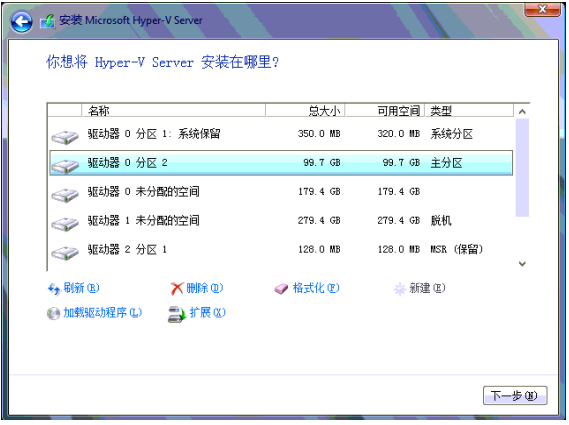

7. 系统显示复制文件，系统安装完成将自动重启

 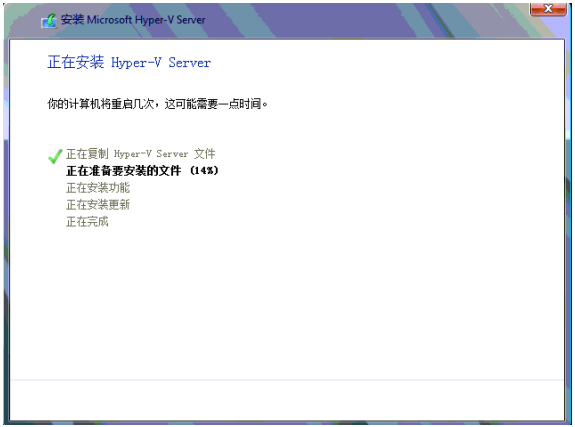

### 第2节 配置Hyper-v Server 2012

 Hyper-v Server 2012 的配置主要任务：
 
 - 设置计算机名
 - 设置工作模式：workgroup/Domain
 - 配置网络地址
 - 远程桌面
 - 远程管理
 
1. 第一次登录时，系统需要设定默认复杂度的密码，如password@88

 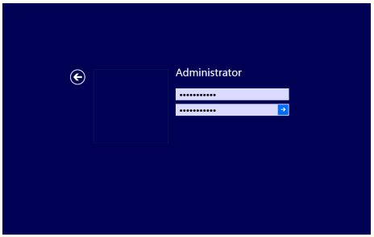

2. 系统默认自动运行Sconfig.cmd和cmd.exe

 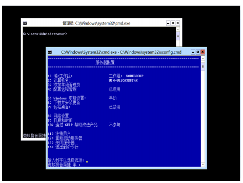

3. 在Sconfig.cmd窗口上，改变计算机名：输入数字2，完成后，提示重新启动计算机。

 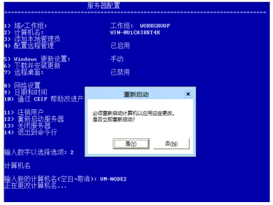

4. 远程管理，输入数字4，进入远程管理设置条目。
 -   输入1，激活MMC远程管理（MMC Remote Managemen），即开放Windows Firewall定义中MMC和Virtual Disk Service出入规则（建议启用）
 -   输入3，允许ping操作 
 
 
 
5. 远程桌面管理，输入数字7，进入远程桌面管理条目
 -   输入E，激活远程桌面连接
 -   输入2，允许客户端以任何版本的远程桌面进行连接
 
 
 
6. 配置网络设置，输入数字8.进入网络配置条目，选择需要设置的网卡的Index号，进入网卡网络配置条目

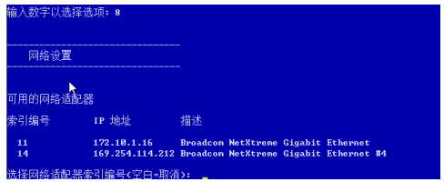

 -   IP地址为静态，输入S，定义静态IP地址，子网掩码，网关
 -   输入2，设置首要的DNS服务器的IP地址和代替的DNS服务器的IP地址
 
## 第2章 远程管理
 远程管理Hyper-v Server 2012 主要有几种方式：

 - Windows Server 2012 的远程管理工具 Hyper-V 工具
 - Windows 8 中的远程管理工具中的 Hyper-V 工具
 - Microsoft System Center Virtual Machine Manager 2012
 
### 第1节 Hyper-V工具

 **安装Hyper-V管理工具**

 若要在 Windows Server 2012 或 Windows Server 2012 R2 上安装 HYPER-V 管理工具
 
1.  在 **服务器管理器**, ，单击 **管理** 菜单，然后单击 **添加角色和功能**。
2.  选择您 **安装类型** ，然后单击 **下一步**。
3.  选择想要安装工具上，单击的服务器 **下一步**。
4.  选择 **功能** 的左侧窗格中。
5.  在 **功能** 所选内容窗格中，打开 **远程服务器管理工具** ，然后打开 **角色管理工具**。
6.  在下 **HYPER-V 管理工具**, 选择相应的工具，然后单击 **下一步**。
7.  确认适当的工具将安装然后单击 **安装**。

若要在 Windows 8 或 Windows 8.1 上安装 HYPER-V 管理工具

1.  打开 **程序和功能**。 HYPER-V 的 HYPER-V 管理工具。
2.  选择 **打开或关闭 Windows 功能**。
3.  在 Windows 功能对话框中，展开 HYPER-V。
 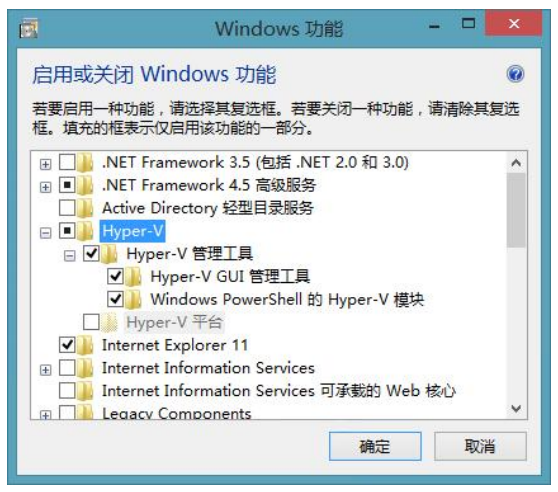
4.  选中相应的工具的框，然后单击 **确定**。

### 第2节 WorkGroup 模式管理模式
#### 2.2.1 Hyper-V主机
1. 确认配置远程管理服务已启动
 

2. 增加本地管理员账号vmadmin

 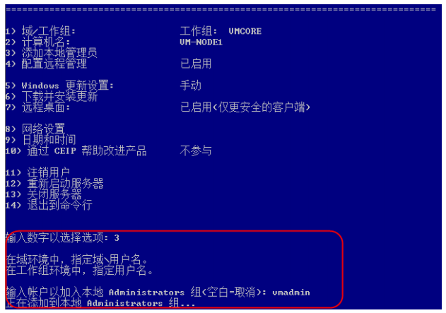

#### 2.2.2 远程Windows 2012

1.DNS 解析，编辑C:\Windows\System32\drivers\etc\hosts
```java
# localhost name resolution is handled within DNS itself.
# 127.0.0.1 localhost
# ::1       localhost
172.10.0.5 vm-node1
172.10.0.6 vm-node2
```
2.创建虚拟管理的本地账户，若用 administrator 管理不需要创建
```java
net user vmadmin password@00 /add
net localgroup administrators "vmadmin" /add
```
3.授权用户
```java
cmdkey /add:172.10.0.5 /user: vmadmin /pass
cmdkey /add:172.10.0.6 /user: vmadmin /pass
```
4.重启本机

5.在 Hyper-V 管理器，选择“连接到服务器”。来连接远程的 Hyper-V 主机。

#### 2.2.3 远程Windows 8

1.DNS 解析，编辑C:\Windows\System32\drivers\etc\hosts

```java
# localhost name resolution is handled within DNS itself.
# 127.0.0.1 localhost
# ::1       localhost
172.10.0.5 vm-node1
172.10.0.6 vm-node2
```
2.创建虚拟管理的本地账户，若用 administrator 管理不需要创建
```java
net user vmadmin password@00 /add
net localgroup administrators "vmadmin" /add
```
3.授权用户
```java
cmdkey /add:172.10.0.5 /user: vmadmin /pass
cmdkey /add:172.10.0.6 /user: vmadmin /pass
```
4.在组件服务中，选择计算机，我的电脑，右键属性，设置“编辑限制”

5.将 ANONYMOUS Logon 允许 “远程访问”

6.重启本机

7.在 Hyper-V 管理器，选择“连接到服务器”。来连接远程的 Hyper-V 主机。


